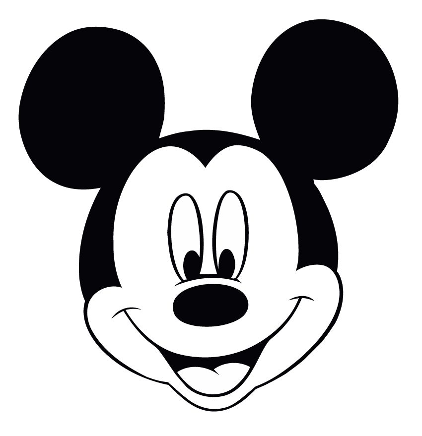
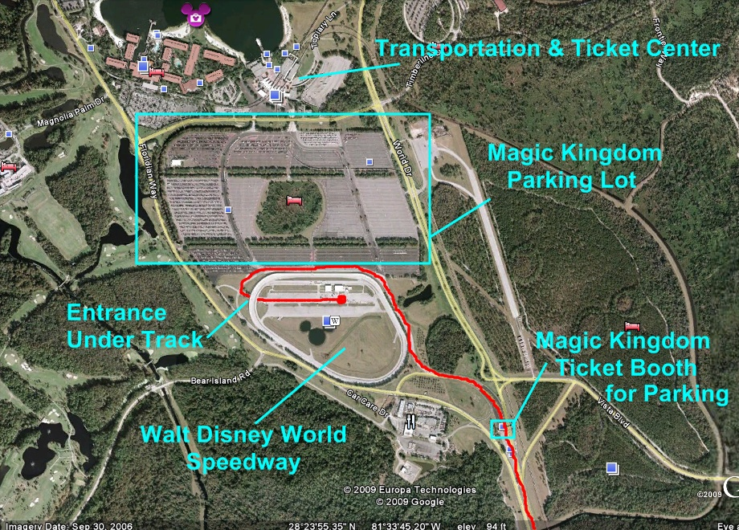

# IDS6145(SimTech 2018) - DISNEYWORLD "MAGIC KINGDOM" VISITORS ENTRANCE SYSTEM 

# MouseHeadz

> * ADAM HARDNEY
> * BLAKE NGUYEN
> * MICHAEL STERKEL
> * RACHEL STRANEY

> * Project Title: MAGIC KINGDOM VISITORS ENTRANCE SYSTEM

# Abstract
Disney's Magic Kingdom is one of the most visited  theme parks in the world. According to the Themed Entertainment Association in their Global Attractions Attendance Report, Magic Kindom had over 20 million visitors in 2015. (http://www.teaconnect.org/images/files/TEA_160_611852_160525.pdf) With a large number of visitors coming into the park daily, the entrance can quickly become overcrowded. The goal is to move quests efficiently and safely through the Entrance and into the park. 

(Abstract here - basically your pitch with some modification - but short overview)

(directions, - remove)
* (this Readme should "evolve" over time as you add and edit it)
* (once you are happy with it - copy it into the proposal directory, and remove the obvious sections that should be removed - Future work, etc)

## General Introduction

(States your motivation clearly: why is it important / interesting to solve this problem?)
(Add real-world examples, if any)
(Put the problem into a historical context, from what does it originate? Are there already some proposed solutions?)

(You should begin by introducing your topic. In this section, you should define the core terminology specific to the field, introduce the problem statement, and make clear the benefits (motivate!) of resolving that problem statement. The main difference between the ABSTRACT and Introduction sections is that the abstract summarizes the entire project, including results, whereas the introduc-tion only provides the motivation of the problem and an overview of the proposed solution.)

(I tell sutdents to answer the questions, one paragaph each to start if you are lost)

(Problem Statement. One paragraph to describe the prob-lem that you are tackling.)

(Motivation. Why is this problem interesting and relevant to the research community?)

(Proposed Solution. How do we propose to tackle this problem (that has been identified in the previous para-graphs, is interesting to the community, and has yet to be tackled by other researchers)?)

(Contributions. An enumeration of the contributions of the senior design project)

(This project makes the following contributions:)(you must have this!!)
•	(Contribution 1)
•	(Contribution 2)

## The Model

(Provide structural and behavior diagrams of the system you wish to study.) (Why is your model a good abtraction of the problem you want to study?) (Are you capturing all the relevant aspects of the problem?) (Use the model to tell us what is going on.)

(explicitly list your requirements of what the model will have and simulate for the proposal)

## Fundamental Questions
(At the end of the project you want to find the answer to these questions) (Formulate a few, clear questions. Articulate them in sub-questions, from the more general to the more specific. )

## Expected Results
(What are the answers to the above questions that you expect to find before starting your research?) (This changes from Expected (Proposal) to just Results (final report)) (you should verbally define them) (sketch a few graphs of what you are roughly going for - not the data but histogram of this, line graph of that, screenshot of an agent - use paper and pencil sketches)

## Research Methods
(Cellular Automata, Agent-Based Model, Discrete Event Continuous Modeling...)(Python or Anylogic) (If you are not sure here: 1. Consult your colleagues, 2. ask the teachers, 3. remember that you can change it afterwards) (Steps in the process)

## (Other)
(change the title and amount of headers as needed) (mention datasets you are going to use) (mention base code or examples you)

## Discussion
(final only - remove whole section for proposal Readme) (What would you have done differently) (What are the contributions summerize)(what is the big take away)(what did you learn)

## Future Work
(final only - remove whole section for proposal Readme) (if you had 6 more months what would be the next steps in this project.) (What are a few questions you have now)

## References
(Add the bibliographic references you intend to use)  (Code / Projects / blogs / websites / papers...)